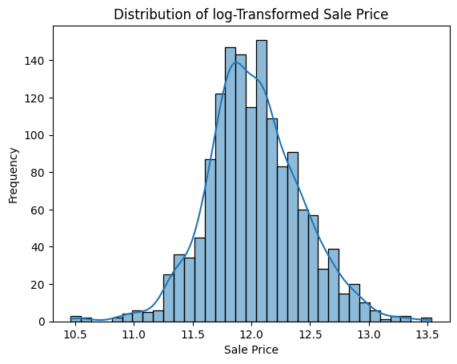
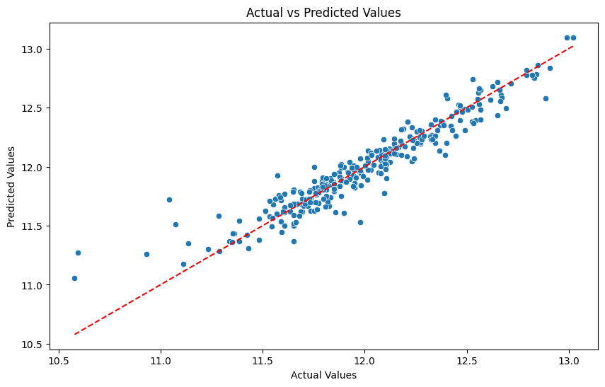

# House Price Prediction – Data Analysis & Machine Learning

## Project Overview

This project analyzes residential housing data and builds machine learning models to predict house sale prices based on various structural and neighborhood features.

The project follows a **complete end-to-end data science workflow**, including:

- Business understanding
- Data auditing
- Data cleaning
- Exploratory Data Analysis (EDA)
- Feature engineering
- Model development
- Model evaluation

The main objective is to **identify key factors influencing house prices and build an accurate predictive model**.

---

# Dataset

This project uses the **House Prices – Advanced Regression Techniques** dataset from Kaggle.

Dataset Link:  
https://www.kaggle.com/competitions/house-prices-advanced-regression-techniques

### Dataset Characteristics

- **1460 observations**
- **79 explanatory variables**
- **Target variable:** `SalePrice`

The dataset contains information about:

- Structural attributes of houses
- Property quality
- Basement features
- Garage characteristics
- Neighborhood location
- Construction and renovation details

---

# Project Structure
```
House-Prices-Dataset/

│
├── data
│   ├── raw
│   └── processed
│
├── notebooks
│   ├── 01_business_understanding.ipynb
│   ├── 02_data_audit.ipynb
│   ├── 03_data_cleaning.ipynb
│   ├── 04_eda_analysis.ipynb
│   ├── 05_feature_engineering.ipynb
│   ├── 06_modeling.ipynb
│   └── 07_model_evaluation.ipynb
│
├── models
│   ├── model.pkl
│   └── test.pkl
│
├── src
│   └── utils.py
│
└── README.md
```

Each notebook represents a **stage of the data science pipeline**, making the project modular and easy to follow.

---

# Data Science Workflow

## 1. Business Understanding

The objective of the project is to:

- Understand the key drivers of house prices
- Explore relationships between housing features and sale prices
- Build a predictive model capable of estimating house prices accurately

---

## 2. Data Audit

The dataset was first inspected to evaluate its quality and structure.

Key checks included:

- Dataset dimensions
- Data types of features
- Missing value analysis
- Statistical summaries

This step helped identify potential issues before data preprocessing.

---

## 3. Data Cleaning

Data preprocessing steps included:

- Handling missing values in numerical and categorical features
- Filling numerical values using the **median**
- Filling categorical missing values with `"None"` where they represent absence of a feature
- Ensuring no remaining missing values
- Applying **log transformation to the target variable (`SalePrice`)** to reduce skewness

The cleaned dataset was saved for further analysis.

---

## 4. Exploratory Data Analysis (EDA)

EDA was conducted to understand the relationship between features and house prices.

Key analyses performed:

- Distribution analysis of `SalePrice`
- Numerical feature distributions
- Categorical feature analysis
- Correlation analysis
- Outlier detection

### Important Visualizations

- SalePrice distribution
- Correlation heatmap
- SalePrice vs Overall Quality
- SalePrice vs Living Area
- SalePrice by Neighborhood

---

### Key Insights from EDA

Some important findings from exploratory analysis include:

- **OverallQual** (overall house quality) is the strongest predictor of house price.
- Larger living areas (**GrLivArea**) significantly increase property value.
- Basement area (**TotalBsmtSF**) positively impacts pricing.
- Garage capacity (**GarageCars**) correlates with higher house prices.
- **Neighborhood location** plays a major role in determining property values.

These insights guided the **feature engineering and modeling stages**.

---

## 5. Feature Engineering

New features were created to capture additional useful information from the dataset.

### Engineered Features

**TotalSF**  
Total square footage combining basement and floor areas.

**HouseAge**  
Age of the property calculated using the construction year.

**RemodelAge**  
Years since the last renovation.

**TotalBathrooms**  
Combined metric including full and half bathrooms.

**TotalPorchSF**  
Total porch area derived from multiple porch-related features.

These engineered features improved the predictive capability of the models.
### Feature Importance
OverallQual

GrLivArea

GarageCars

TotalBsmtSF

Neighborhood

---

## 6. Machine Learning Models

Multiple regression models were trained and evaluated:

- Linear Regression
- Ridge Regression
- Lasso Regression
- Random Forest Regressor

### Data Preparation

- Categorical variables encoded using **One-Hot Encoding**
- Dataset split using **80/20 train-test split**

---

## 7. Model Evaluation

Model performance was evaluated using:

- **Root Mean Squared Error (RMSE)**
- **R² Score**

Additional evaluation included:

- Residual analysis
- Actual vs Predicted visualization
- Feature importance analysis

---
## Sample Visualizations

### SalePrice Distribution



### Model Performance



### Model Performance Comparison

The performance of different regression models was evaluated using RMSE and R² score.

| Model | RMSE | R² Score |
|------|------|------|
| Linear Regression | 0.13 | 0.86 |
|**Ridge Regression** | **0.12**| **0.92** |
| Lasso Regression | 0.17 | 0.86 |
| Random Forest Regressor | 0.14 | 0.89 |

*Note: SalePrice was log-transformed during training, so RMSE values correspond to the log scale.*
## Final Model

The **Ridge Regressor** achieved the best performance.

### Why Ridge Regressor?

- Captures nonlinear relationships
- Handles feature interactions well
- Provides feature importance insights
- Robust against overfitting compared to simple models

The final model effectively predicts housing prices based on structural and location-based features.

---

# Technologies Used

- Python
- Pandas
- NumPy
- Matplotlib
- Seaborn
- Scikit-learn
- Jupyter Notebook

---

# How to Run the Project

### 1. Clone the repository
    git clone https://github.com/VishnuVardhanKasireddy/data-analysis-portfolio.git
### 2. Navigate to the project folder


cd data-analysis-portfolio/House-Prices-Dataset


### 3. Install dependencies


pip install -r requirements.txt


### 4. Download the dataset

Download the dataset from Kaggle and place it inside:


data/raw/


### 5. Run notebooks in order


- 01_business_understanding.ipynb
- 02_data_audit.ipynb
- 03_data_cleaning.ipynb
- 04_eda_analysis.ipynb
- 05_feature_engineering.ipynb
- 06_modeling.ipynb
- 07_model_evaluation.ipynb


---

# Project Conclusion

This project demonstrates a **complete end-to-end data science workflow** from raw dataset analysis to predictive modeling.

Key takeaways:

- House quality and living area are the strongest predictors of price.
- Basement size and garage capacity also influence pricing.
- Neighborhood location significantly affects property value.

The **Ridge Regression model successfully captures these relationships and produces accurate predictions.**

---

# Author

**Vishnu Vardhan Kasireddy**

Data Analysis & Machine Learning Portfolio Project