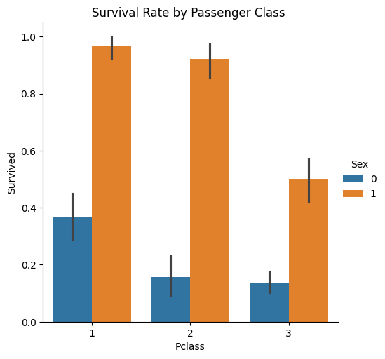
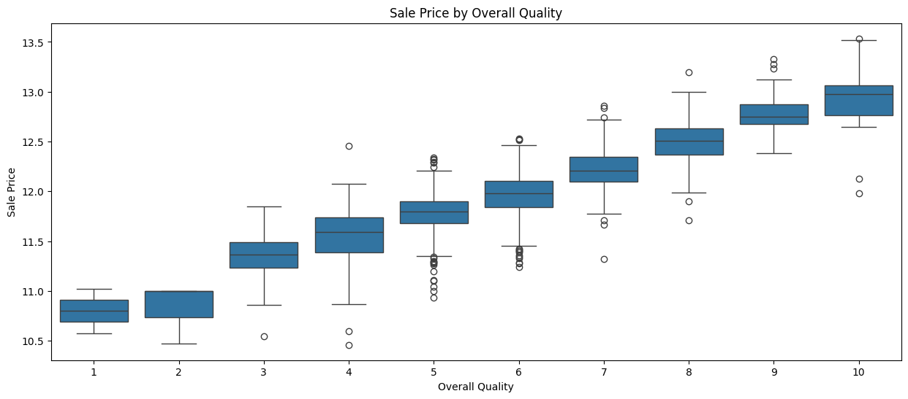
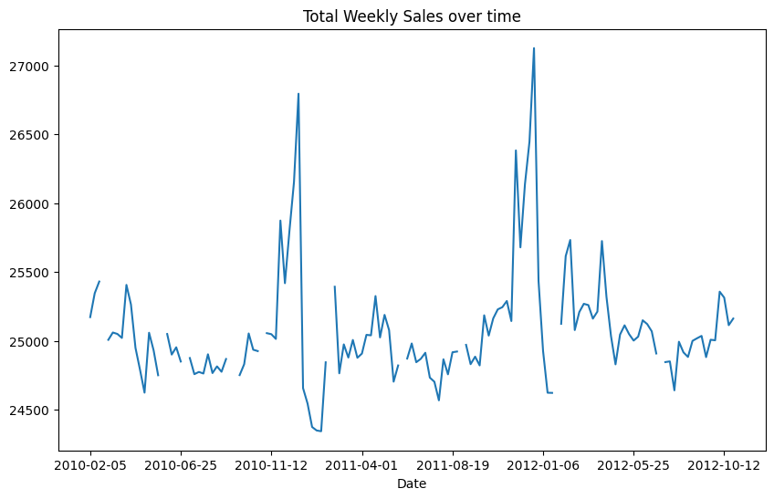

# 📊 Data Analysis Portfolio


This repository contains a collection of **real-world data analysis projects** demonstrating structured problem-solving, data cleaning, exploratory analysis, and insight generation.

The focus is on applying a **consistent analytical workflow** across datasets and extracting meaningful, actionable insights.

---
## ⭐ Portfolio Highlights

- 📊 3 End-to-End Data Analysis Projects  
- 🧠 Covers Classification, Regression & Time-Series  
- 🔧 Real-world data cleaning and feature engineering  
- 📈 Insight-driven analysis with business recommendations  

---

# 🧠 Analytical Approach

Each project follows a structured workflow:

### 1. Problem Understanding
- Define objective and target variable  
- Identify key analytical questions  

### 2. Data Understanding
- Inspect dataset structure  
- Identify feature types  

### 3. Data Quality Assessment
- Detect missing values, duplicates, inconsistencies  
- Analyze distributions and anomalies  

### 4. Data Cleaning
- Handle missing values (median/mode/domain-based)  
- Treat outliers  
- Fix data types  

### 5. Feature Engineering
- Create derived features  
- Encode categorical variables  
- Transform skewed data  

### 6. Exploratory Data Analysis
- Univariate, bivariate, multivariate analysis  
- Correlation and trend analysis  

### 7. Insight Extraction
- Identify key drivers  
- Quantify observations  

### 8. (Optional) Modeling
- Build baseline models  
- Evaluate performance  

---

# 📂 Featured Projects

---

## 🚢 Titanic Survival Analysis



**🔹 Type:** Classification  
**🔹 Techniques:** EDA, Feature Engineering, Machine Learning  

**Overview**
- Analyzed passenger data to identify key factors influencing survival probability  

**Key Work**
- Engineered features such as FamilySize, IsAlone, and Title extraction  
- Explored relationships between survival and demographic factors  
- Built and compared multiple classification models  

**Insights**
- Female passengers had ~74% survival rate vs ~19% for males  
- Higher-class passengers had significantly better survival outcomes  
- Family structure influenced survival probability  

🔗 [View Project](./Titanic-Survival-Dataset)

---

## 🏠 House Prices Analysis



**🔹 Type:** Regression  
**🔹 Techniques:** Data Cleaning, Feature Engineering, Modeling  

**Overview**
- Investigated key factors affecting residential property prices  

**Key Work**
- Handled extensive missing values and categorical encoding  
- Engineered features such as total area and house age  
- Analyzed correlations and feature importance  

**Insights**
- Overall quality and living area strongly impact house prices  
- Larger properties and newer constructions have higher valuation  
- Location-related features significantly influence pricing  

🔗 [View Project](./House-Prices-Dataset)

---

## 🏬 Walmart Sales Analysis (Time-Series)



**🔹 Type:** Time-Series Analysis  
**🔹 Techniques:** Data Merging, Trend Analysis, Seasonality  

**Overview**
- Performed large-scale analysis on 400K+ records to understand sales behavior  

**Key Work**
- Merged multi-table datasets (train, features, stores)  
- Extracted time-based features (year, month, week)  
- Analyzed trends, seasonality, and holiday effects  
- Evaluated store and department performance  

**Insights**
- Sales exhibit strong seasonal patterns with peaks during holiday periods  
- Significant variation exists across stores, influenced by size and type  
- A small number of departments contribute disproportionately to total revenue  
- External economic factors show weak correlation with sales  

🔗 [View Project](./Walmart-Sales-Dataset)

---

# 📊 Skills Demonstrated

- Data Cleaning & Preprocessing  
- Exploratory Data Analysis (EDA)  
- Feature Engineering  
- Time-Series Analysis  
- Data Visualization  
- Machine Learning  

---

# 🛠️ Tools & Technologies

- Python  
- Pandas, NumPy  
- Matplotlib, Seaborn  
- Scikit-learn  
- Jupyter Notebook  

---

# 📁 Repository Structure
```
data-analysis-portfolio/
│
├── Titanic-Survival-Dataset/
├── House-Prices-Dataset/
├── Walmart-Sales-Dataset/
├── assets/
└── README.md
```
---
# 📌 Conclusion

This portfolio demonstrates a structured approach to analyzing real-world datasets across different domains, including classification, regression, and time-series analysis.

Key takeaways from the projects:

- Applied consistent data analysis workflow from data cleaning to insight extraction  
- Handled real-world data challenges such as missing values, inconsistencies, and skewed distributions  
- Identified meaningful patterns such as survival factors, price determinants, and seasonal sales trends  
- Demonstrated the ability to translate data into actionable insights and business recommendations  

Overall, the analysis highlights the importance of **data-driven decision-making**, where understanding patterns and relationships in data can lead to more informed and effective strategies.