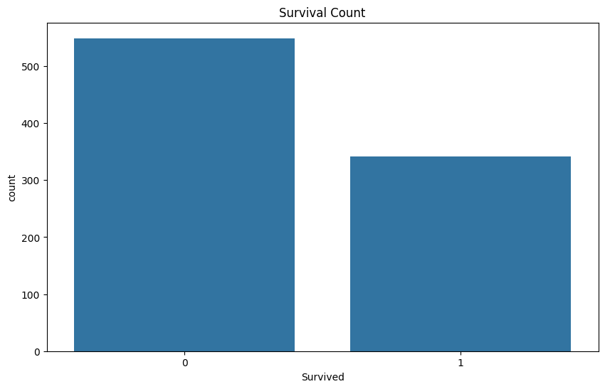
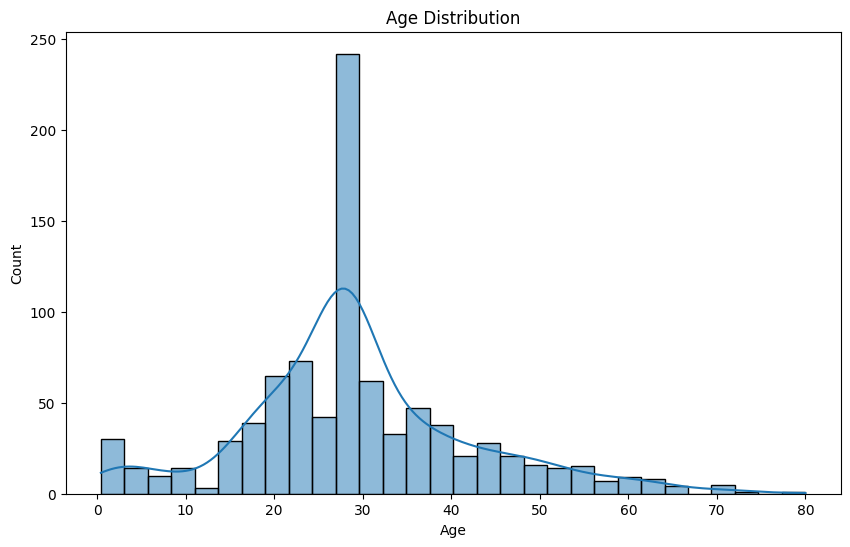
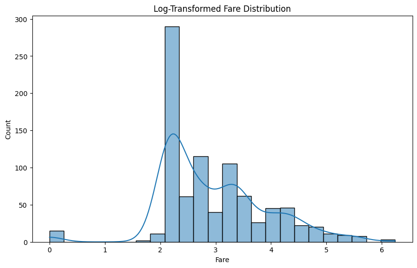
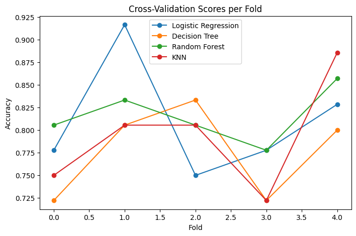
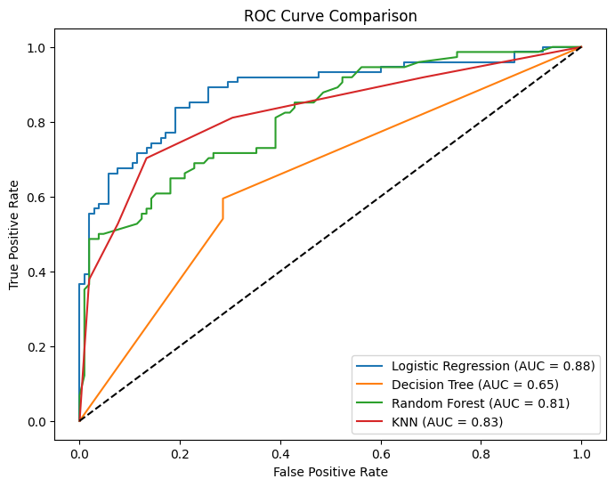

# 🚢 Titanic Survival Analysis – Exploratory Data Analysis (EDA)

## 📌 Project Overview
This project performs a comprehensive **Exploratory Data Analysis (EDA)** on the Titanic dataset to identify key factors that influenced passenger survival. The goal is to extract meaningful insights, handle real-world data issues, and build a baseline predictive model.

---

## 🎯 Objective
To analyze passenger data and answer:

- What factors most influenced survival?
- How did demographics and class affect outcomes?
- Can we build a basic model to predict survival?

---

## 📊 Dataset Description
The dataset contains information about Titanic passengers, including:

- Demographics (Age, Sex)
- Socio-economic status (Pclass, Fare)
- Family information (SibSp, Parch)
- Travel details (Embarked, Cabin)
- Target variable: **Survived (0 = No, 1 = Yes)**

---

## ⚠️ Data Quality Assessment

| Issue | Observation |
|------|------------|
| Missing Values | Age (~19%), Cabin (~77%), Embarked (~0.2%) |
| Duplicates | No duplicate records found |
| Data Types | Mix of numerical and categorical |
| Skewness | Fare highly right-skewed |

---

## 🧹 Data Cleaning Strategy

- Cabin dropped due to excessive missing values
- Age filled using median imputation
- Embarked filled using mode
- Handled outliers in Fare
- Converted categorical features into appropriate formats

---

## ⚙️ Feature Engineering

- **FamilySize** = SibSp + Parch + 1  
- **IsAlone** = 1 if passenger traveled alone  
- **Title Extraction** from Name (Mr, Mrs, Miss, etc.)

---

## 📈 Exploratory Data Analysis

### 🔹 Survival Distribution


### 🔹 Survival by Class by Gender


### 🔹 Age Distribution


### 🔹 Fare Distribution


---

## 🔍 Key Insights

- Female passengers had ~74% survival rate vs ~19% for males  
- First-class passengers had significantly higher survival rates  
- Smaller families had better survival chances  
- Higher fare correlated with higher survival probability  
- Children had relatively higher survival rates  

---

### 📊 Model Performance Visualization



---

## 🤖 Model Comparison

| Model | Accuracy |
|------|----------|
| Logistic Regression | 79.005587 |
| Decision Tree |64.245810|
| Random Forest | 81.743017 |
| KNN | 79.888268 |

### 🏆 Best Model
Random Forest performed best, indicating **non-linear relationships** in the dataset.

---

## 📊 Evaluation Metrics

- Accuracy Score  
- Cross-validation  
- Model comparison visualization  

---

## 📌 Conclusion

Survival was strongly influenced by:

- Gender  
- Passenger class  
- Family structure  

This project demonstrates how **EDA + feature engineering** can extract meaningful insights from real-world data.

---

## 🚀 Future Improvements

- Hyperparameter tuning  
- Feature selection  
- Model explainability (SHAP)  
- Deployment  

---

## 🛠️ Tech Stack

- Python  
- Pandas, NumPy  
- Matplotlib, Seaborn  
- Scikit-learn  

---

## 📂 Project Structure
```
Titanic-Survival-Dataset/
│
├── data/
├── notebooks/
├── visuals/
├── reports/
└── README.md
```


---

## 👨‍💻 Author

**Vishnu Vardhan Kasireddy**

---

⭐ If you found this useful, consider starring the repo!