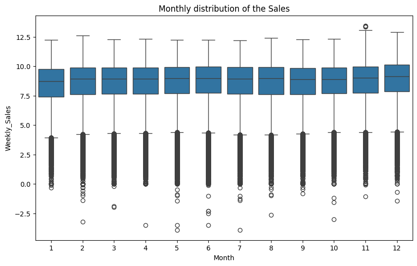
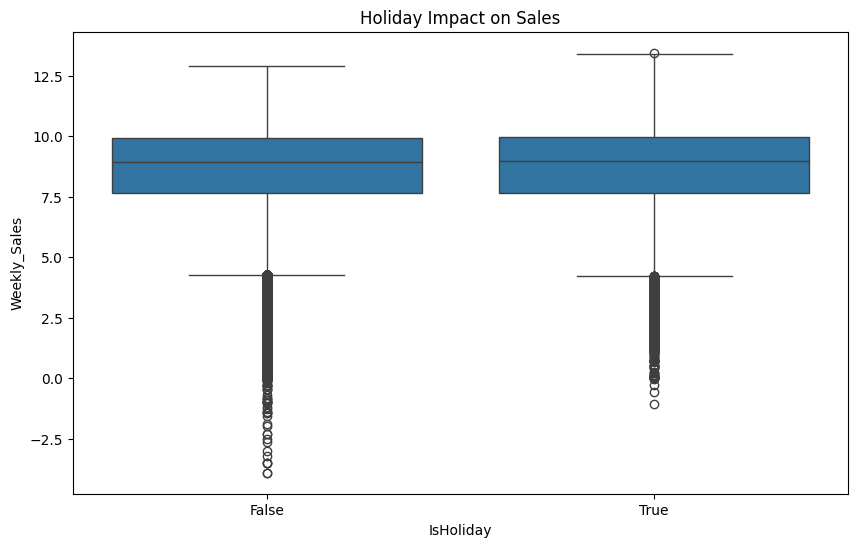
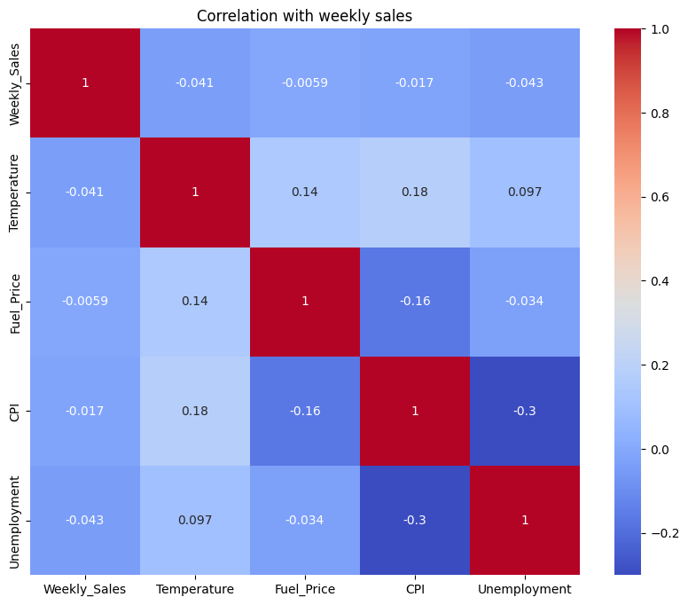

# 🏬 Walmart Sales Analysis – Time Series & EDA

## 📌 Project Overview
This project analyzes Walmart’s weekly sales data to uncover trends, seasonal patterns, and key factors influencing sales across stores and departments. It combines **multi-table data merging, time-series analysis, and business insights**.

---

## 🎯 Objective

- Analyze sales trends over time  
- Identify seasonal and holiday effects  
- Evaluate store and department performance  
- Understand impact of external factors  

---

## 📊 Dataset Description

The dataset includes:

- `train.csv` → Weekly sales  
- `features.csv` → External factors  
- `stores.csv` → Store metadata  

Final dataset: **421,000+ rows, 17 columns**

---

## 🔗 Data Integration

- Merged datasets using `Store` and `Date`
- Cleaned duplicate columns (`IsHoliday`)
- Created a unified dataset for analysis

---

## ⚠️ Data Cleaning

| Issue | Action |
|------|--------|
| Missing MarkDown values | Filled with 0 |
| Missing numeric values | Median imputation |
| Date format | Converted to datetime |
| Duplicate columns | Cleaned |

---

## ⚙️ Feature Engineering

- Extracted **Year, Month, Week**
- Created time-based features
- Handled promotional markdown variables

---

## 📈 Exploratory Data Analysis

### 🔹 Sales Trend Over Time


- Periodic spikes indicate strong seasonal demand  
- Sales remain stable outside peak periods  

---

### 🔹 Seasonality Analysis


- Peak sales in **November–December**  
- Clear monthly variation  

---

### 🔹 Holiday Impact


- Higher sales during holidays  
- Increased variability and spikes  

---

### 🔹 Store Performance


- Significant variation across stores  
- Larger stores generate higher revenue  

---

### 🔹 Department Analysis


- Few departments dominate total sales  
- Strong category concentration  

---

### 🔹 Correlation Heatmap


- Weak correlation with external factors  
- Sales driven mainly by internal factors  

---

## 🔍 Key Insights

- Sales show strong **seasonality** with holiday peaks  
- Holidays significantly boost sales and variability  
- Store performance varies widely  
- Few departments contribute most revenue  
- External factors have minimal short-term impact  

---

## 💡 Business Recommendations

- Increase inventory during holidays  
- Focus on high-performing departments  
- Invest in top-performing stores  
- Use seasonal patterns for pricing strategies  

---

## 🤖 Modeling 

- Implemented **Random Forest Regressor**
- Captures non-linear relationships in sales data  

---

## 📌 Conclusion

Sales are primarily influenced by **seasonality and store-level factors**, while external economic indicators have limited impact.

---

## 🛠️ Tech Stack

- Python  
- Pandas, NumPy  
- Matplotlib, Seaborn  
- Scikit-learn  

---

## 📂 Project Structure
```
Walmart-Sales-Dataset/
│
├── data/
├── notebooks/
├── visuals/
├── reports/
└── README.md

```

---

## 👨‍💻 Author

**Vishnu Vardhan Kasireddy**

---

⭐ If you found this useful, consider giving it a star!